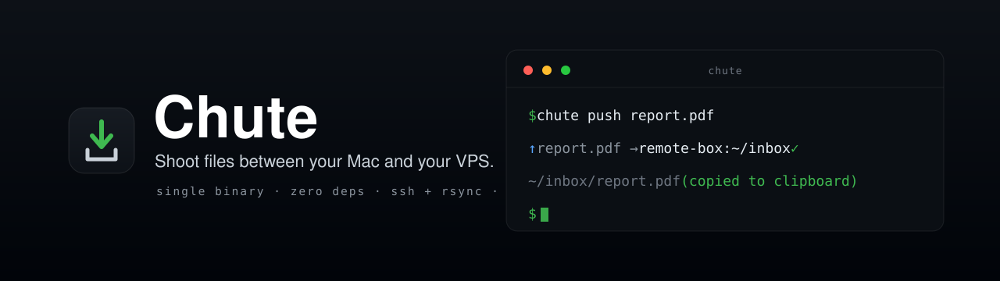

<p align="center">
  
</p>

<p align="center">
  <b>Shoot files between your Mac and your VPS from the terminal — one command, path on your clipboard.</b><br>
  A tiny, zero-dependency CLI wrapper around <code>ssh</code> + <code>rsync</code>, with a macOS menu-bar companion.
</p>

<p align="center">
  <a href="https://github.com/tugay0/chute/actions/workflows/ci.yml"></a>
  <a href="https://github.com/tugay0/chute/releases/latest"></a>
  
  
  <a href="LICENSE"></a>
</p>

---

## Why

You live in a terminal on a remote box, but getting a file *onto* it is clumsy — save it,
remember the `scp`/`rsync` incantation, retype the path. **Chute** makes it a reflex:

```console
$ chute push report.pdf
→ pushing 1 item(s) → remote-box:~/inbox/
✓ sent — remote path copied to clipboard:
  ~/inbox/report.pdf
```

The remote path is already on your clipboard, ready to paste into the box's shell.

## Install

**Homebrew** (macOS / Linux):

```bash
brew install tugay0/tap/chute
```

**curl** (any Unix):

```bash
curl -fsSL https://raw.githubusercontent.com/tugay0/chute/main/install.sh | bash
```

**Go** (from source):

```bash
go install github.com/tugay0/chute/cmd/chute@latest
```

Chute shells out to `ssh` and `rsync`, which ship with macOS and every Linux box — nothing else to install.

## 60-second quickstart

<table>
<tr><td width="34"><b>1</b></td><td>

**Point Chute at your box.** Hosts are `~/.ssh/config` aliases or plain `user@host`.

```bash
chute targets add box user@1.2.3.4 '~/inbox/'
```

</td></tr>
<tr><td><b>2</b></td><td>

**Shoot a file up.** The remote path lands on your clipboard.

```bash
chute push screenshot.png
#  ~/inbox/screenshot.png  (copied)
```

</td></tr>
<tr><td><b>3</b></td><td>

**Grab one back down.**

```bash
chute pull logs/app.log --dest ~/tmp
```

</td></tr>
<tr><td><b>4</b></td><td>

**Keep a folder in sync** while you work.

```bash
chute watch ./dist          # auto-mirrors on every change
```

</td></tr>
</table>

Run `chute doctor` any time to check `ssh`/`rsync` and test the connection.

## Commands

| Command | What it does |
|---|---|
| `chute push <path>... [--to name] [--dry-run] [--no-copy]` | Send files/folders up; prints & copies the remote path. |
| `chute pull <remote>... [--from name] [--dest dir]` | Bring files down (remote paths are relative to the target folder). |
| `chute watch [dir] [--to name] [--interval 2s] [--delete]` | Mirror a local folder up on change (polling, no extra deps). |
| `chute targets [list \| add <name> <host> <folder> \| use <name> \| rm <name>]` | Manage send targets. |
| `chute config [show \| path \| edit]` | Show config, print its path, or open it in `$EDITOR`. |
| `chute doctor [--to name]` | Diagnose ssh/rsync/clipboard and probe the target. |

## How it works

Chute is deliberately boring: every transfer is a plain `rsync -az --progress -e ssh` you could
have typed yourself. There's no daemon, no account, no telemetry.

- **Config** lives at `~/.config/chute/config.json` (respects `XDG_CONFIG_HOME`). A *target* is a
  name → `host:folder`. The default is `inbox → remote-box:~/inbox/`.
- **Hosts** are whatever `ssh` understands — an alias from `~/.ssh/config` or `user@host`. Chute
  never touches your keys or agent; it just runs `ssh`.
- **Clipboard**: on success `push` copies the remote path (via `pbcopy`, or `wl-copy`/`xclip`/`xsel`
  on Linux) so you can paste it straight into the box.

**Environment overrides**

| Var | Purpose | Default |
|---|---|---|
| `CHUTE_SSH` | ssh command rsync uses | `ssh` (e.g. `ssh -p 2222`) |
| `CHUTE_RSYNC_OPTS` | base rsync flags | `-az --progress` |
| `CHUTE_CONFIG_DIR` | config directory | `~/.config/chute` |
| `NO_COLOR` | disable colored output | unset |

## The menu-bar companion (macOS)

The same idea, hands-free: [`app/`](app/) is a tiny AppKit menu-bar app that lives under your notch.
Drag a file onto the pill, hover + **⌘V** to paste, or **⌥⌘4** to snip a screen region — it lands on
your box and copies the path, using the same transport as the CLI. See [`app/SPEC.md`](app/SPEC.md).

```bash
cd app
./sign-setup.sh   # once: a stable self-signed identity so permissions persist
./build.sh        # builds + signs → build/Chute.app
open build/Chute.app
```

## Contributing

Issues and PRs welcome — see [CONTRIBUTING.md](CONTRIBUTING.md). The CLI is pure Go standard library,
so `go build ./...` and `go test ./...` are all you need.

## License

[MIT](LICENSE) © Tugay Alyıldız
